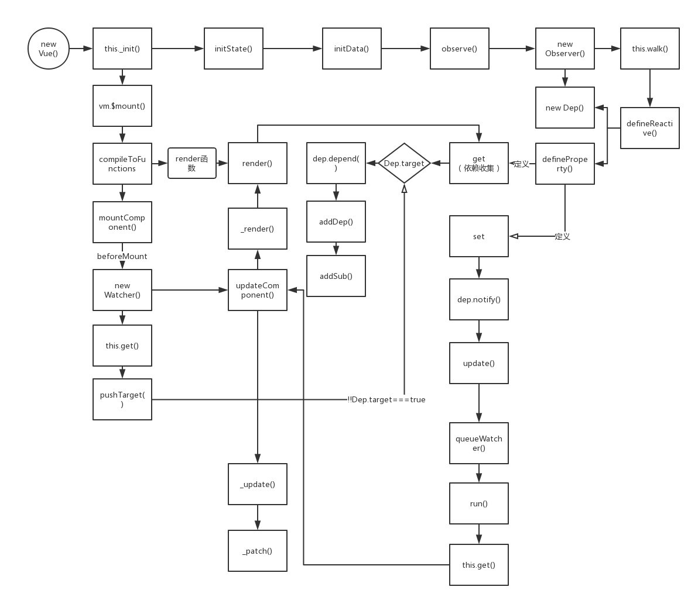

# 双向绑定
待续。。。
先上一张流程图


示例

    <!DOCTYPE html>
        <html lang="en">
          <head>
            <title></title>
            <meta charset="UTF-8">
            <meta name="viewport" content="width=device-width, initial-scale=1">
          </head>
          <body>
            <section class="simple">
              <div class="title">{{ title }}</div>
              <input type="text" v-model="title">
            </section>
            <script src="../dist/vue.js"></script>
            <script>
              var app = new Vue({
                data: {
                  title: 'hello'
                }
                // mounted() {
                //   setTimeout(() => {
                //     this.title = 'abc'
                //   }, 3000)
                // }
              })
              app.$mount('.simple')
            </script>
          </body>
        </html>


生成的render函数


```js
(function () {
      with (this) {
        return _c('section', {
          staticClass: "simple"
        }, [_c('div', {
          staticClass: "title"
        }, [_v(_s(title))]), _v(" "), _c('input', {
          directives: [{
            name: "model",
            rawName: "v-model",
            value: (title),
            expression: "title"
          }],
          attrs: {
            "type": "text"
          },
          domProps: {
            "value": (title)
          },
          on: {
            "input": function ($event) {
              if ($event.target.composing)
                return;
              title = $event.target.value
            }
          }
        })])
      }
    }
    )
```
通过input事件实现视图到数据的绑定

> new Vue()
> this_init()
> initState()
> initData()
> observe()
> new Observer()
> this.walk()
> defineReactive()
> new Dep() 
> Object.defineProperty()
> get:
> dep.depend()
> set:
> dep.notify()

待续
