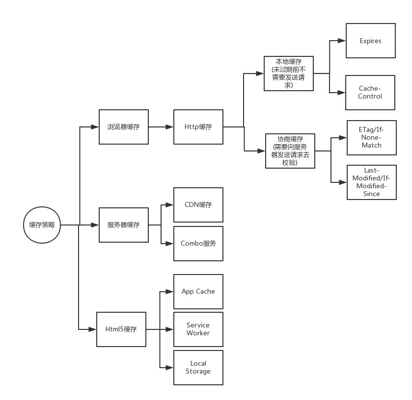

# 缓存

## 分类

## 字段
|规则|消息报头|值/示例|类型|作用
|---|-------|------|----|---|
|新鲜度|Expires||响应|告诉浏览器在过期前可以直接使用副本，无需发送请求（可能存在客户端时间不一致问题）,优先级低于 Cache-Control
||Pragma|no-cache(旧浏览器)|响应|告诉浏览器忽略缓存副本，强制每次请求直接发送给服务器
||Cache-Control|cache|响应|直接使用本地缓存，不发生请求
|||no-cache|响应|告诉浏览器忽略缓存副本，强制每次请求直接发送给服务器
|||no-store|响应|告诉浏览器在任何情况下都不要缓存任何副本
|||must-revalidate|响应|强制浏览器遵守已设置的缓存规则
|||proxy-revalidate|强制proxy严格遵守你设置的cache规则。
|||max-age|响应|指明副本的有效缓存时长，从请求开始到过期时间点之间的秒数
|||public|响应|任何缓存者（本地缓存或者中间代理）都可以缓存
|||privite|响应|只针对单个用户或者实体(不同用户，窗口)缓存资源
|||s-maxage|响应|与max-age相同，只针对代理有效，优先级高于max-age
||Last-Modified||响应|告诉浏览器资源的最后修改时间
||If-Modified-Since||请求|如果浏览器第一次请求时，响应中的Last-Modified非空，则在第二次请求时会把它作为该项的值发送给服务器
|校验值|ETag||响应|告诉浏览器该资源在服务器的唯一标识符（生产规则由服务器决定），优先级高于Last-Modified
||If-None-Match||请求|如果浏览器第一次请求时，响应中的ETag非空，则在第二次请求时会把它作为该项的值发送给服务器
|辅助|Vary|Accept-Encoding|响应|辅助从多个缓存副本中筛选出合适的副本（不同压缩算法产生的副本）
## 用户操作与缓存
|用户操作|Expires/Cache-Control|Last-Modified/ETag|
|------|----------------------|------------------|
|地址栏回车|有效|有效|
|页面链接跳转|有效|有效|
|新开窗口|有效|有效|
|前进/后退|有效|有效|
|F5刷新|有效|无效|
|Ctrl+F5强制刷新|无效|无效|
## 使用策略
