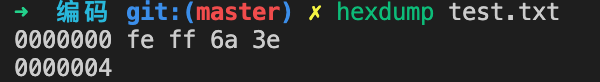
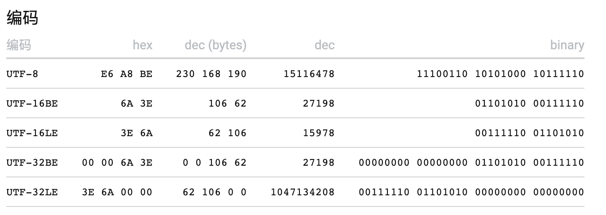

开始之前先强调两个概念`字符集`与`字符编码`

>顾名思义，字符集就是多个字符的集合，是一个系统支持的所有抽象字符的集合。字符是各种文字和符号的总称，包括各国家文字、标点符号、图形符号、数字等，如[GB2312](https://www.qqxiuzi.cn/zh/hanzi-gb2312-bianma.php)、[Unicode](https://zh.wikipedia.org/wiki/Unicode)等。

>字符编码是一套规则，它将一种字符集当中的编号索引映射为计算机能够处理的二进制信息。计算机由编码后的二进制信息根据编码规则得到字符的索引，然后对着相应的字符集就能将其还原成人们所能理解的字符信息（如文字或者表情）。编码后的数据更方便在计算机中存储或和网络之间传输。常见的编码方式如UTF-8等。

>在Unicode普及以前，早期的编码如ASCII、[GB2312](https://www.qqxiuzi.cn/zh/hanzi-gb2312-bianma.php)、[Big5](https://www.qqxiuzi.cn/zh/hanzi-big5-bianma.php)、[GBK](https://www.qqxiuzi.cn/zh/hanzi-gbk-bianma.php)、[GB18030](https://www.qqxiuzi.cn/zh/hanzi-gb18030-bianma.php)等，一般只使用一种编码方式，所以不仅代表字符集(可能由多个子集组成)，同时也代表了其对应的编码方式。比如 ASCII 既是字符集又是编码方案，GB2312 用的则是 EUC-CN 编码方案；而Unicode就只单纯地代表字符集，编码方式则有多种，如UTF-8、UTF-16等。

## Unicode相关
### [Unicode](https://zh.wikipedia.org/wiki/Unicode)
这里只简要介绍一下。

官方中文名称为统一码，也译名为万国码、国际码、单一码，是计算机科学领域的业界标准。它整理、编码了世界上大部分的文字系统，使得电脑可以用更为简单的方式来呈现和处理文字。Unicode的发展由非营利机构统一码联盟负责，并伴随着通用字符集的标准而发展。

>说到 Unicode 必须同时说一说 UCS-2 和 UCS-4。早期 Unicode 在编制通用字符集之时，ISO 组织也在做同样的事情，ISO 开展了 ISO/IEC 10646 项目，名字叫“ Universal Multiple-Octet Coded Character Set”，中文译为“通用多八位编码字符集”，英文简称UCS。

>后来，双方意识到不需要同时制定两套通用的字符集，所以双方开始进行整合，到 Unicode 2.0 时，Unicode 编码和 UCS 编码都基本一致。

>UCS-2 采用 16 位存储空间，两个字节编码每个字符，而 UCS-4 采用 4 个字节（实际上只用了 31 位，最高位必须为 0）编码。UCS-2 有 216=65536 个码位，UCS-4 有 231=2147483648 个码位。

>UCS-4 根据最高位为 0 的最高字节分成 27=128 个组（group）。每个组再根据次高字节分为 256 个平面（plane）。每个平面根据第 3 个字节分为 256 行 (rows)，每行包含 256 个单元（cells）。当然同一行的单元只是最后一个字节不同，其余都相同。

>0 组的 0 号平面被称作 Basic Multilingual Plane，即基本多文种平面，简写 BMP。可知 BMP 区域内的字符只使用了两个字节，码位从 U+0000 至 U+FFFF。它实际上就是 UCS-2 的全部编码范围，后来因为码位不够用才扩展为 UCS-4。

>Unicode 最初也是采用两个字节编码字符，后来发现不够用才扩展为四个字节（与 UCS-4 对应）。理论上 UCS-4 编码范围能达到 U+7FFFFFFF，容纳二十多亿个字符，但是因为 Unicode 和 ISO 达成共识，只会用到 17 个平面，包含 1 个基本平面（BMP）和 16 个辅助平面，最高码位 U+10FFFF。

|平面 | 编码范围 | 中文名称 | 英文名称|
|  ----  | ----  | ----  | ----  |
0号平面 | U+0000 - U+FFFF |基本多文种平面 | Basic Multilingual Plane,简称BMP|
1号平面 | U+10000 - U+1FFFF |多文种补充平面 | Supplementary Multilingual Plane,简称SMP|
2号平面 | U+20000 - U+2FFFF |表意文字补充平面 | Supplementary Ideographic Plane,简称SIP|
3号平面 | U+30000 - U+3FFFF |表意文字第三平面 | Tertiary Ideographic Plane,简称TIP|
4～13号平面 | U+40000 - U+DFFFF |（尚未使用）  |
14号平面 | U+E0000 - U+EFFFF |特别用途补充平面 | Supplementary Special-purpose Plane,简称SSP|
15号平面 | U+F0000 - U+FFFFF| 保留作为私人使用区（A区）| Private Use Area-A,简称PUA-A|
16号平面 | U+100000 - U+10FFFF |保留作为私人使用区（B区） | Private Use Area-B,简称PUA-B|
以上内容来自[千千秀字](https://www.qqxiuzi.cn/wz/zixun/1663.htm)

现今世界上绝大多数的常用的字符包括中文字符都位于0号平面。emoji表情则位于1号平面。

如果想了解更多Unicode字符相关的可以使用这个网站[https://Unicode-table.com/cn](https://Unicode-table.com/cn)。通过输入文字查看改字符的Unicode码点，不同编码方案的数值等信息。
### UTF-8的编码规则
UTF-8是一种变长多字节编码方案，使用1-4个字节进行编码。
具体方式为，对于UTF-8编码中的任意字节B：

- 如果B的第一位为0，则B独立的表示一个字符(ASCII码)；
- 如果B的第一位为1，第二位为0，则B为一个多字节字符中的一个字节(非ASCII字符)；
- 如果B的前两位为1，第三位为0，则B为两个字节表示的字符中的第一个字节；
- 如果B的前三位为1，第四位为0，则B为三个字节表示的字符中的第一个字节；
- 如果B的前四位为1，第五位为0，则B为四个字节表示的字符中的第一个字节；

| Unicode码点范围(十六进制) | UTF-8编码方式（二进制）| 字节数 | 字符种类 |
|------------------------|---------------------|-------|------|   
| U+0000~U+007F| 0xxxxxxx| 1 | ASCII中的字符 | 
| U+0080~U+07FF | 110xxxxx 10xxxxxx | 2 | 带有附加符号的拉丁文、希腊文、西里尔字母、亚美尼亚语、希伯来文、阿拉伯文、叙利亚文及它拿字母|
| U+0800~U+FFFF | 1110xxxx 10xxxxxx 10xxxxxx | 3 | 其他基本多文种平面（BMP）中的字符（这包含了大部分常用字，如大部分的汉字）|
| U+10000~U+10FFFF  | 11110xxx 10xxxxxx 10xxxxxx 10xxxxxx | 4 | 其他极少使用的Unicode 辅助平面的字符 |

简单来说就是通过数一个字节的前几位，0开头的代表这个字节单独代表一个字符，不为0这代表这是个多字节字符，需要连起来看，开头有几个1就需要几个字节。比如，110(两个1)开头则代表需要两个字节，后面的一个字节属于该字符，其他以此类推。将剩余的`x`占的位置连起来表示的就是该字符在Unicode中的码点。四字节的编码一共有21个空位，最大能表示2的21次方(2097152)大于Unicode的码点范围上限10FFFF(1114111)。

### UTF-16的编码规则
在UTF-16中，16位比特为一个码元，UTF-16用一个码元表示基本平面的字符，用两个码元表示辅助平面的字符。基本平面的字符在UTF-16中的编码与其在Unicode中的码位相同。比如字母A的Unicode码位为U+0041，其UTF-16的编码为0041(BE)。那么问题来了，如何确定两个连续的码元代表的是一个辅助平面的字符还是两个基本平面的字符？

在基本平面内，从U+D800到U+DFFF之间的码位区段是永久保留不映射到Unicode字符。也就是说这个区间的编码不代表任何字符。UTF-16就利用保留下来的0xD800-0xDFFF区块的码位来对辅助平面的字符的码位进行编码。换句话说就是，一个码元的值如果位于0xD800-0xDFFF之间，则表明这是一个辅助平面字符的一部分，需要跟前面或者后面的一个码元组合起来才能代表一个字符。

UTF-16又将U+D800-U+DFFF之间的区域一分为二，其中小的U+D800-U+DBFF为UTF-16的高半区(亦称前导代理、高位代理)，大的DC00-DFFF	为UTF-16的低半区(亦称后尾代理、低位代理)，每个半区都有1024个码点，这样高位低位的组合一共就有1024x1024=1048576种了，足以覆盖辅助平面的所有字符了。换句话说，辅助平面字符的两个码元，每个码元虽然只有1024个码点，但是两个码元组合起来就有1048576种了。

除此之外，由于前导代理、后尾代理、基本平面中的有效字符的码位，三者互不重叠，搜索是简单的：一个字符编码的一部分不可能与另一个字符编码的不同部分相重叠（通过文本中的任意一个码元就可以判定它代表的是一个基本平面字符还是辅助平面的前导代理或者后尾代理）。这意味着UTF-16是自同步（self-synchronizing）的：可以通过仅检查一个码元来判定给定字符的下一个字符的起始码元。

### UTF-32编码规则
UTF-32 使用四个字节来表示存储代码点：把代码点转换为 32 位二进制，位数不够的左边充 0。
举个栗子：
[樾](https://unicode-table.com/cn/6A3E/)的Unicode码点为`U+6A3E`，转换为二进制就是`1101010 00111110`，前面补0到32位就是`00000000 00000000 01101010 00111110`，这就是UTF-32的编码值。跟Unicode的码点是一致的。与前两种相比，可以看出相当浪费空间并且更容易遭到截断，所以用的不多。

### BOM(Byte Order Mark)
UTF-16与UTF-32都有BE(Big-Endian)、LE(Little-Endian)两种编码方式，简单说就是一个字符的字节，如果高位在前就是BE，反之则是LE。换句话水按从左到右正着解析的就是BE，倒着就是LE（要强调的是，这个顺序只是针对一个字符的而不是整个文本的）。因此UTF-16与UTF-32编码的文本需要再文本的开头指定是BE还是LE。如果开头两个字节是非`fe ff`(这俩不好记，我的理解是后面的ff比前面的fe大，所以是正序)则是BE，如果是`ff fe`则是LE。
实践一下验证一下：
通过vscode保存一段文本，选择编码为UTF-16BE保存：

然后通过hexdump命令(mac自带)查看该文件的二进制内容：

呐，对的上吧，后面的两个字节就是`樾`的UTF-16编码值。

UTF-8则可有可无，如果如果文件的开头是`ef bb bf`则有BOM。不过这三个字节即使去掉也不影响文本的解读，纯属多余。
### 不同编码之间的转换原理
针对Unicode字符集的不同编码方案(UTF-8、UTF-16、UTF-32)之间的转换相对比较容易，只要能通过编码值解析到其在Unicode中的码点，然后再按对应的编码方案进行编码即可。

但是针对UTF-8与GBK等之间的转换就没那么方便的了，因为他们所查的字符集是不同的，没有一个共同的交集。我了解的方案是，如果需要转换，则要维护一个GBK字符集与Unicode之间的一个映射表。这样才能找到GBK编码的字符在Unicode中的位置，反之亦然。

### Javascript中的字符转换相关的方法

1. 如何通过编码转换成对应的字符以及如何获取一个字符的`Unicode`编码

- 由字符获取对应的Unicode编码：`String.prototype.codePointAt()`，它返回一个Unicode编码点值得非负整数。

- 从Unicode字符编码获取对应的字符：`String.fromCodePoint()`，它是一个静态方法，返回使用指定的代码点序列创建的字符串。

>上述两个方法为ES6新增，可以支持转换完整的Unicode字符，而`String.fromCharCode()`、`String.prototype.charCodeAt()`只支持转换BMP(基本多文种平面，范围0~65535)的字符，超出则无法转换。ps：`codePointAt`与`fromCodePoint`可以分别通过`charCodeAt`和`fromCharCode`进行polyfill。

## 划重点

1. [通用字符集（UCS）](https://zh.wikipedia.org/wiki/%E9%80%9A%E7%94%A8%E5%AD%97%E7%AC%A6%E9%9B%86)
   >是由ISO制定的ISO 10646（或称ISO/IEC 10646）标准所定义的标准字符集。[下载地址](https://standards.iso.org/ittf/PubliclyAvailableStandards/c076835_ISO_IEC_10646_2020(E).zip)(字符集从65页开始)

2. [GB 13000](http://openstd.samr.gov.cn/bzgk/gb/std_list?p.p1=0&p.p90=circulation_date&p.p91=desc&p.p2=13000): 
   >字符集，UCS的等同采用，可以理解为把国际标准拿来作为国家标准，东西还是那么个东西，但是更新没有UCS那么频繁，迄今只有两个版本。
3. Unicode与UCS的关系
   >Unicode与UCS是由两个不同组织创建和维护的，但是互相兼容，可以认为两者是等同的。
4. 码位（Code Point）
   >字符在字符集中的位置，它是一个数值。
5. 码元（Code Unit）
   >是指一个已编码的文本中具有最短的比特组合的单元。对于UTF-8来说，一个码元是8比特长；对于UTF-16来说，一个码元是16比特长；对于UTF-32来说，一个码元是32比特长。
6. UTF-8、UTF-16、UTF-32又是什么、它们与Unicode的关系，以及各自之间的区别
   >UTF-8、UTF-16、UTF-32都属于字符编码方式，对应的字符集就是Unicode。UTF-16、UTF-32都有大端(BE)、小端(LE)两种编码方式。UTF-8，采用变长多字节编码，用1-4个字节进行编码；UTF-16采用两个或者四个字节进行编码；UTF-32采用4个字节进行编码。用的最多的编码方式当属UTF-8，因为在大部分互联网场景下最节省空间(汉字需要另说，针对绝大部分中文字符，UTF-8需要3个字节，UTF-16则只需要两个)。
7. UTF-8与常见的GB18030之间的区别
   >两者都采用变长多字节进行编码，但是UTF-8对汉字通常采用三个字节进行编码，而GB18030大都使用两个字节，也就是说对于中文，采用GB18030编码占用的空间通常更小。
8. GB2312、GBK、GB18030、GB13000之间又是什么关系？
    >GB2312、GBK、GB18030通常意义上代表一种编码方式，不过也可以代表其对应的字符集；GB13000则只代表一种字符集。然而GBK、GB18030又都收录GB13000(GB 13000.1-93)中所有的字符。
    GB2312、GBK、GB18030的区别主要在每种方案字符数量不同，越新的方案包含的字符越多。但是他们的编码都是向后兼容的，既后一种编码的字符集包含前一种的，相同字符对应的编码也是相同的，然后将新增的字符分配在其他区域。比如：

      |  汉字   | GB2312  | GBK | GB18030 | Unicode|
      |  ----  | ----  | ----  | ----  | ----  |
      | 七  | C6DF | C6DF | C6DF | 4E03 |
      | 八  | B0CB | B0CB | B0CB | 516B |
      | 愛  |  无  | 90DB | 90DB | 611B |
   通过[https://www.qqxiuzi.cn/bianma/zifuji.php](https://www.qqxiuzi.cn/bianma/zifuji.php)这个网页可以查看汉字在不同方案下的编码数值。

9.  为什么有了Unicode还需要其他那么多编码方案？
    >Unicode大约在2000年左右随着计算机在世界范围内的普及与不同国家之间的网上交流日益频繁后，才得到计算机操作系统的广泛支持。在此之前基本都是各玩各的，所以才会有其他那么多的编码方案(ASCII、GB2312等)的存在。现在互联网世界基本都是以Unicode和UTF-8为主了。

https://www.zhihu.com/question/21887246/answer/19631235